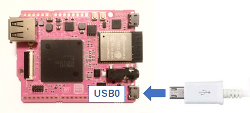
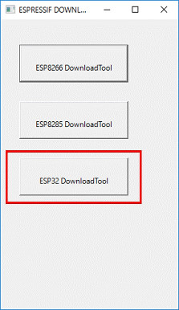
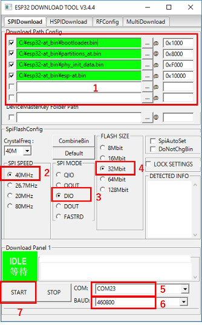
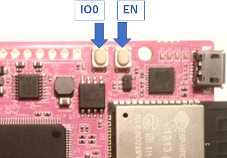

# TCPSocketWiFi_Example_for_ESP32
GR-LYCHEE上のESP32をATコマンドで操作するサンプルプログラムです。  
GR-LYCHEEの開発環境については、[GR-LYCHEE用オフライン開発環境の手順](https://developer.mbed.org/users/dkato/notebook/offline-development-lychee-langja/)を参照ください。

ビルドする前に``mbed_app.json``の SSID と Passwordを変更してください。  
```json
{
    "config": {
        "wifi-ssid": {
            "help": "WiFi SSID",
            "value": "\"SSID\""
        },
        "wifi-password": {
            "help": "WiFi Password",
            "value": "\"Password\""
        }
    }
}
```

## ESP32をATコマンド用のファームウェアに書き換える
本サンプルプログラムを使用する際はESP32をATコマンド用のファームウェアに書き換える必要があります。  
ここでは、``GR-LYCHEE_ESP32_Serial_Bridge``と``Windows PC版 Flash Download Tools V3.4.4``を使った書き込み方法を紹介します。  

まずはプロジェクト内`docs\esp32-at_bin.zip`を展開し、``GR-LYCHEE_ESP32_Serial_Bridge.bin``をGR-LYCHEEに書き込んでください。  

### シリアルドライバ
``GR-LYCHEE_ESP32_Serial_Bridge``はGR-LYCHEEのUSB0ポートをPCと接続して使用します。  

  

Windows10以外ご使用の場合、ドライバのインストールが必要となります。下記サイトの「Driver required on Windows!」からドライバーをダウンロードできます。  

https://developer.mbed.org/handbook/USBSerial

但し、「署名なしドライバ」となっていますので、お使いのWindowsバージョンによってはそのままインストールすることはできません。お使いのPC毎に設定方法が異なるため、検索サイトで「署名なしドライバ」で検索してください。  


### ESP32のFlash書き込み
Flash Download Toolsを下記からダウンロードしてください。  

Espressif’s official Flash Download Tools:  
http://espressif.com/en/support/download/other-tools?keys=&field_type_tid%5B%5D=13

`flash_download_tools_v3.4.4.zip`を展開し、`ESPFlashDownloadTool_v3.4.4.exe`を実行します。  

  
*ESP32 DownloadTool* を選択します。  

  

1. `docs\esp32-at_bin.zip`内の書き込み用の.binファイルを設定します。  
  bootloader.bin(0x1000)、partitions_at.bin(0x8000)、phy_init_data.bin(0xF000)、esp-at.bin(0x10000)を設定してください。左のチェックボックスにも忘れずにチェックを入れてください。  
2. SPI SPEEDに*40MHz*を設定します。  
3. SPI MODEに*DIO*を設定します。  
4. FLASH SIZEに*32Mbit*を設定します。  
5. COMにUSB0に割り当たったCOMポートを設定します。  
6. ボーレートを選択します。460800bpsでの書き込みを確認できていますが、書き込みに失敗するようでしたらボーレートを下げてください。
7. ESP32を書き込みモードにするため、GR-LYCHEEの **US1(IO0)** を押しながら **US0(EN)** を短押し、その後 **US1(IO0)** を離します。ターミナルソフトソフトで該当のCOMポートを開いている場合は、ターミナルソフトを終了させ、COMポートを開放してください。最後にツールのSTARTボタンを押すと書き込みを開始します。  
  
